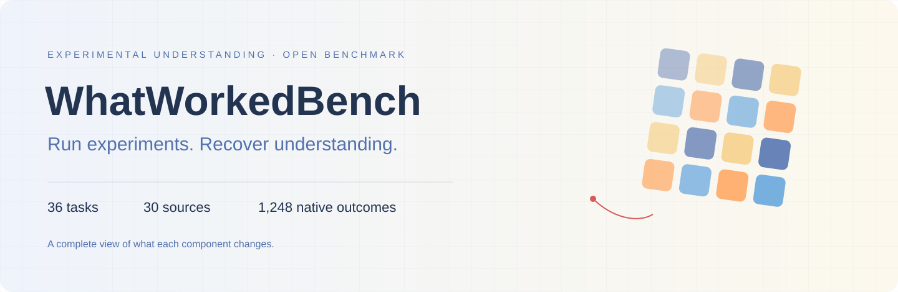
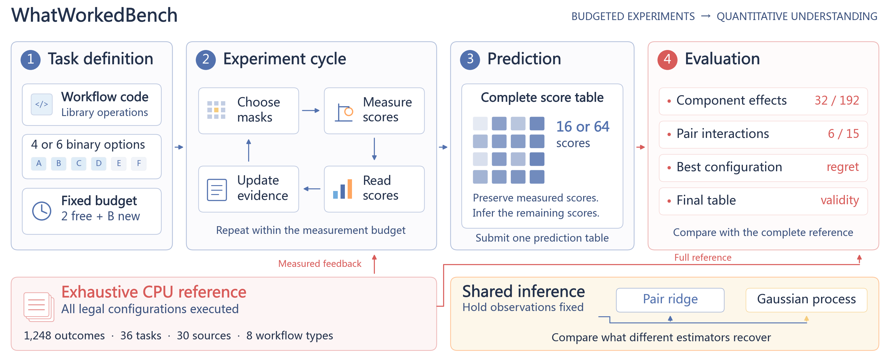

<div align="center">

# WhatWorkedBench

### Benchmarking Experimental Understanding in AI Agents



[](https://ethanning.github.io/WhatWorkedBench/)
[](#paper)
[](benchmark/manifest.json)
[](guides/data-sources.md)
[](LICENSE)

**How much does an AI agent learn from its experiments?**

36 task conditions · 30 sources · 8 workflow families · 1,248 native outcomes

[Get started](#quick-start) · [Protocol](guides/evaluation.md) · [Results](results/) · [Contribute](CONTRIBUTING.md)

</div>

WhatWorkedBench measures an agent's ability to predict how component changes affect an executable workflow after a limited number of experiments. An agent observes two free configurations, spends a measurement budget, and predicts the complete response surface. Exhaustive native CPU execution provides the reference for evaluating component effects, interactions, and configuration choice.



## Release

The first public release includes the complete task catalog, a standalone budgeted evaluator, numerical baselines, native CPU replay, and recorded evidence. The paper's arXiv link will be added when available.

## Quick start

Use Python 3.11+ on Linux. This example runs locally without model API credentials.

```bash
git clone https://github.com/EthanNing/WhatWorkedBench.git
cd WhatWorkedBench
python -m venv .venv
source .venv/bin/activate
python -m pip install -e ".[test]"
python scripts/run_baseline.py --task scifact --budget 8 --method ridge-pair --output output/scifact-ridge
```

The command creates a complete prediction table and its evaluation in the output directory. Use a fresh output directory for each episode.

```bash
python scripts/run_baseline.py --task scifact --budget 8 --method gp-effect --output output/scifact-gp
python -m pytest
python scripts/audit_results.py
python scripts/audit_structure.py
python scripts/audit_added.py
```

## Tasks

| Workflow | Conditions | Sources | Options |
| --- | ---: | ---: | --- |
| Classification | 5 | 4 | 4 / 6 |
| Regression | 5 | 4 | 4 / 6 |
| Clustering | 5 | 4 | 4 / 6 |
| Forecasting | 5 | 4 | 4 / 6 |
| Image restoration | 5 | 4 | 4 / 6 |
| Retrieval | 3 | 2 | 4 / 6 |
| Beat detection | 4 | 4 | 6 |
| Graph link prediction | 4 | 4 | 6 |

The six paired variants share sources with existing four-option tasks. The 1,248 configuration records include 96 repeated original-subcube outcomes. [Browse every task](benchmark/public/tasks/) or explore the searchable catalog on the [project page](https://ethanning.github.io/WhatWorkedBench/#tasks).

## Evaluation

| Dimension | Metric | What it measures |
| --- | --- | --- |
| Component understanding | Conditional-effect MAE and effect recovery | Accuracy of a change's effect across all backgrounds |
| Interaction understanding | Mean pair-interaction MAE | Dependence between two component changes |
| Configuration choice | Selection regret and exact optimum | Quality of the selected configuration |
| Complete reconstruction | Grid MAE and strict effect reconstruction | Accuracy across the full response surface |
| Delivery | Valid complete prediction artifact | Successful completion of the evaluation contract |

The [protocol guide](guides/evaluation.md) defines these metrics and the agent/evaluator information boundary. Expose public tasks and tool receipts to agents while retaining references and episode state on the trusted host.

## Baselines and evidence

The numerical tools include main-effect ridge, pair-interaction ridge, and Gaussian-process inference with grid-variance or effect-variance acquisition. Code-aware GP inference supports visible parameter equivalences in the paired six-option tasks.

The release records **4,206 numerical-control executions** and **124 agent attempts across all eight workflow families**. The 108-episode core study has 94 valid artifacts; a separate eight-episode structure diagnostic has eight, and the added beat/graph cohort has six valid artifacts from eight attempts.

| Comparison | Effect recovery before → after |
| --- | --- |
| Original Flash cohort, B=8; delivered table → shared GP | 0.632 → 0.698 |
| Additional Flash cohort, B=8; delivered table → shared GP | 0.621 → 0.720 |
| Paired six-option tasks, B=20; pair ridge → code-aware GP | 0.248 → 0.462 |
| Structure diagnostic; submitted table → post-hoc code-equivalence projection | 0.338 → 0.507 |
| Added beat/graph workflows, B=32; valid agent table → same-observation GP | 0.303 → 0.455 |

Shared inference and the post-hoc projection reuse the same acquired observations. The code-aware GP comparison changes acquisition and inference. The added-workflow cohort records six valid tables and two provider HTTP 402 interruptions after complete measurement. Cohort and source details are preserved in [results](results/).

## Native replay

```bash
python -m pip install -r native/requirements.txt
mkdir -p output
python native/replay.py --output output/native-audit.json
```

Replay executes all 36 task conditions from prepared inputs, checks saved predictions, and independently recomputes native metrics. [Replay details](native/README.md) · [Source attribution](guides/data-sources.md).

## Repository

```text
benchmark/       Public tasks, evaluator references, source manifests, prompts
whatworkedbench/ Budgeted evaluator and numerical inference tools
native/          Prepared inputs and standalone native CPU replay
results/         Recorded controls, agent predictions, and diagnostics
scripts/         Runnable baseline and offline result audit
tests/           Evaluation-boundary and scoring checks
guides/          Protocol and dataset attribution
docs/            Project website and visual assets
```

## Paper

**WhatWorkedBench: Benchmarking Experimental Understanding in AI Agents**

arXiv · Coming soon. The finalized paper citation will be added with the preprint. Until then, cite the software repository.

```bibtex
@misc{whatworkedbench2026,
  title = {WhatWorkedBench: Benchmarking Experimental Understanding in AI Agents},
  year = {2026},
  howpublished = {Software repository},
  url = {https://github.com/EthanNing/WhatWorkedBench}
}
```

## Contributing and license

See [CONTRIBUTING.md](CONTRIBUTING.md) for methods, tasks, and agent adapters. Project code uses [Apache 2.0](LICENSE), matching the repository's existing license. Third-party datasets retain their [upstream terms](guides/data-sources.md).
